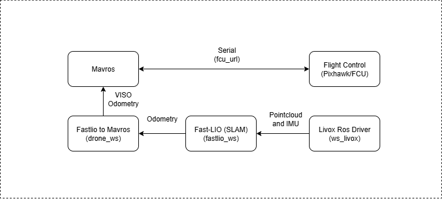
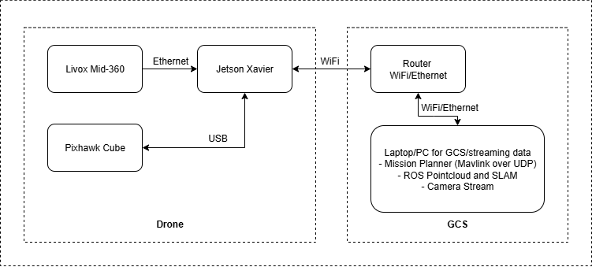

# Drone SLAM with ROS Noetic

This repository is designed to run on **ROS Noetic with Ubuntu 20.04**.  
It has been tested on **Jetson Xavier** and **Jetson Orin Nano**.  
The setup combines Livox LiDAR, MAVROS, and a custom drone package for SLAM.

## List of hardware used:
1. Jetson Xavier NX
2. Livox MID 460
3. Pixhawk Cube

---

## System Architecture


This shows how LiDAR data flows through the Livox ROS Driver into Fast-LIO for SLAM, while MAVROS bridges the flight controller and ground control station.



---

## Setup Instructions

### 1. Install MAVROS
```bash
sudo apt-get install ros-noetic-mavros ros-noetic-mavros-extras
```

### 2. Build Livox ROS Driver 2
```bash
source /opt/ros/noetic/setup.sh
cd ws_livox/src/livox_ros_driver2
./build.sh ROS1
```

#### Configure Livox MID360
Edit the configuration file:

```bash
nano ws_livox/src/livox_ros_driver2/config/MID360_config.json
```

Update the IP addresses as follows:

```json
"lidar_configs" : [
    {
      "ip" : "192.168.1.12",
      "pcl_data_type" : 1,
      "pattern_mode" : 0,
      "extrinsic_parameter" : {
        "roll": 0.0,
        "pitch": 0.0,
        "yaw": 0.0,
        "x": 0,
        "y": 0,
        "z": 0
      }
    }
  ]
```

- Change **192.168.1.5** to your **computer’s IP address**.  
- Change **192.168.1.12** to your **Livox MID360 LiDAR IP address**.  

### 3. Build Fast-LIO SLAM
```bash
cd fastlio_ws
catkin_make
source devel/setup.bash
```

### 4. Build Custom Drone Package
```bash
cd drone_ws
catkin_make
```

---
## Permanent Workspace Sourcing

To avoid sourcing the workspace manually each time, add these lines to your .bashrc:
```
echo "source ~/Autonomous-Drone-SLAM/ws_livox/devel/setup.bash" >> ~/.bashrc

echo "source ~/Autonomous-Drone-SLAM/fastlio_ws/devel/setup.bash" >> ~/.bashrc

echo "source ~/Autonomous-Drone-SLAM/drone_ws/devel/setup.bash" >> ~/.bashrc
```
---

## Running the System

After building all packages, you can start the system with the following commands in separate terminals:

### Start Fast-LIO mapping
```bash
roslaunch fast_lio mapping_mid360.launch
```

### Start Livox ROS Driver
```bash
roslaunch livox_ros_driver2 msg_MID360.launch
```

### Start MAVROS with flight controller and GCS
```bash
roslaunch mavros apm.launch fcu_url:=/dev/ttyACM0:115200 gcs_url:=udp://@0.0.0.0:14550
```

---

## Notes
- Make sure your ROS workspaces are properly sourced before launching.  
- Adjust the `fcu_url` and `gcs_url` parameters according to your hardware setup.  
- This setup is mainly intended for drones equipped with the **Livox MID360 LiDAR**.  

